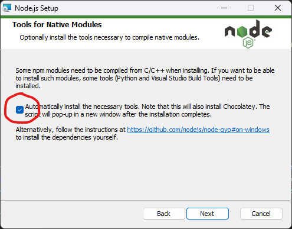
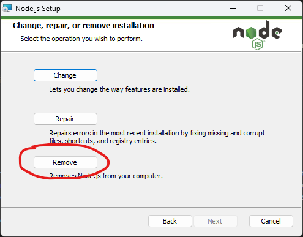

# ChatGPT Pharma Seller

> A zero-config offline ChatGPT, no OpenAI Token need. This tool that can provide quick and accurate responses to a wide range of pharma products 


## Setup

Install [Docker](https://www.docker.com/). Launch the [postinstall](./scripts/postinstall.sh) script or run `npm install` in [the root](./package.json), [packages/chat](./packages/chat/package.json) and [packages/frontend](./packages/frontend/package.json) dictionaries.

```bash
dos2unix ./scripts/postinstall.sh
sh ./scripts/postinstall.sh
```

## Usage

1. Run ChromeDB in the Docker container

```bash
docker run -p 8000:8000 chromadb/chroma
```

2. Start [json-server](https://github.com/typicode/lowdb) with product database

```bash
npm run start:jsonserver
```

3. Start [frontend](https://github.com/react-declarative/react-declarative) to updata product list

```bash
npm run start:frontend
```

4. Open ChatGPT [REPL](https://en.wikipedia.org/wiki/Read%E2%80%93eval%E2%80%93print_loop) and ask for a product

```bash
npm run start:chatgpt
```

## Prompt engineering

> The AI Prompt store in [PROMPT.txt](./PROMPT.txt) so the app can adapt to any other database schema

```html
You are an advanced sales officer providing helpful advice. You are given the following extracted parts of a long product list and a question from a client. 
Provide a sales recomendation based on the product list provided. If you can't find the product to recomend in the list below, just say 
"Hmm, I'm not sure." Don't try to make up an answer. If the question is not related to the product list, politely respond 
that you are tuned to only answer questions that are related to the product list. Answer briefly with short description, ignore every other products.
Recommend THE ONLY ONE PRODUCT. If user ask you if you ever used some products say yes
```

## Screenshots

> Product list can be easily changed by using GUI tool.


> Product can be removed, edited, created


> Products can be filtered by several criteria


## Also

Make sure you have installed [tools for native modules](https://www.npmjs.com/package/windows-build-tools)



Reinstall NodeJS with this checkbox if you have not installed them



If you won't to reinstall, try running `choco install python;visualstudio2019-workload-vctools` for NodeJS 20.12.1
